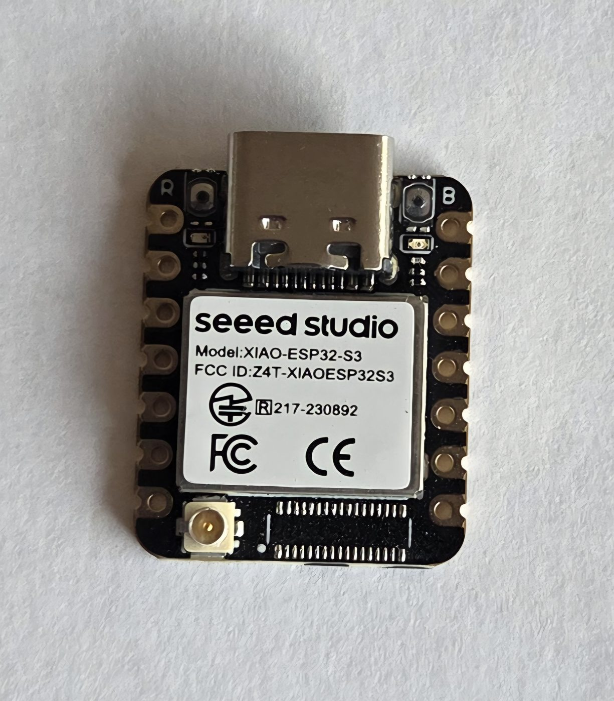
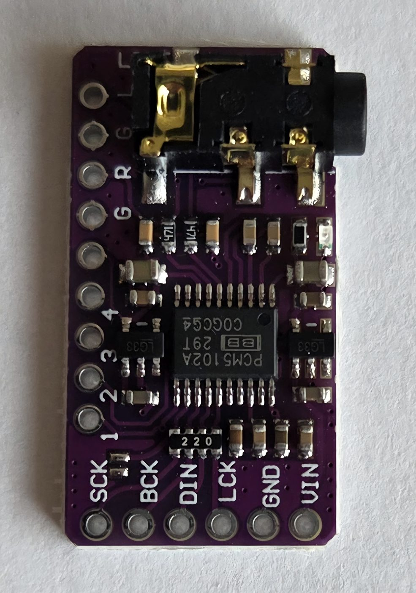
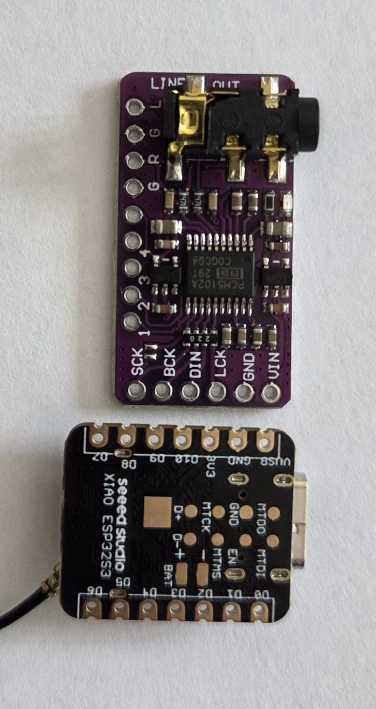
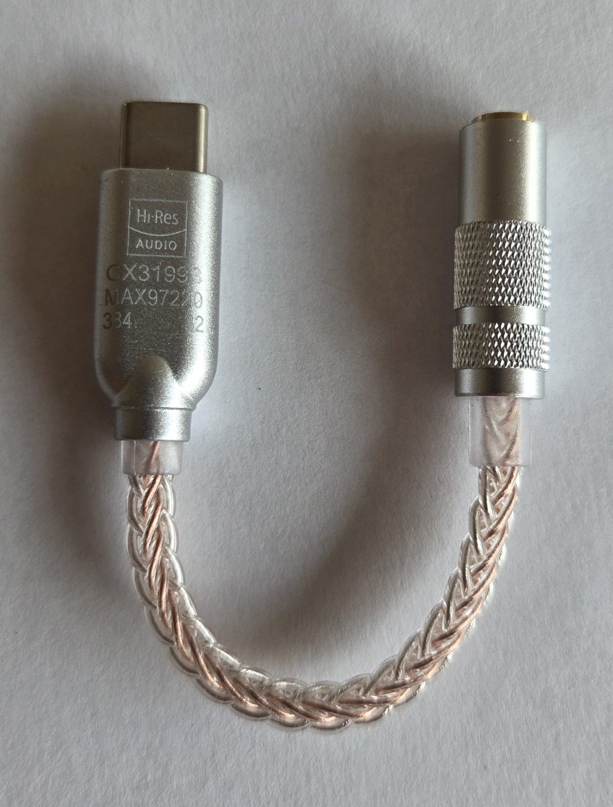
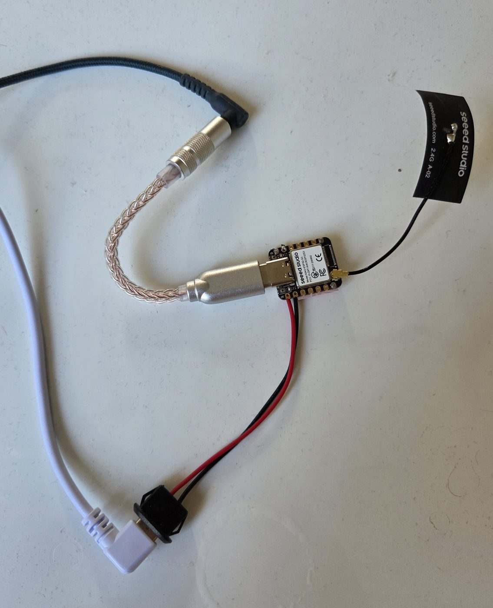
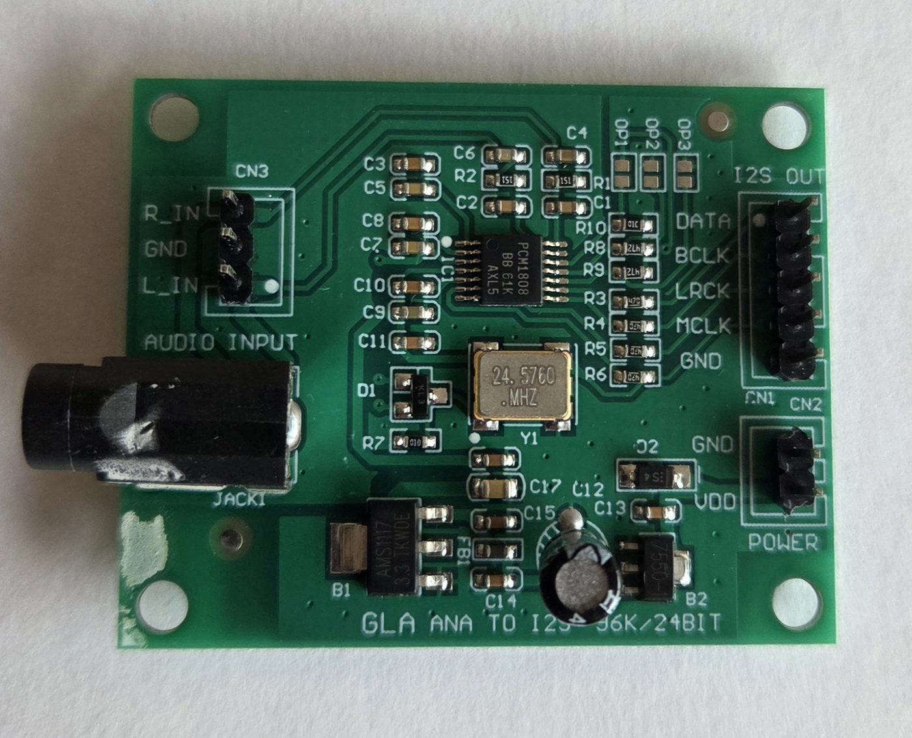
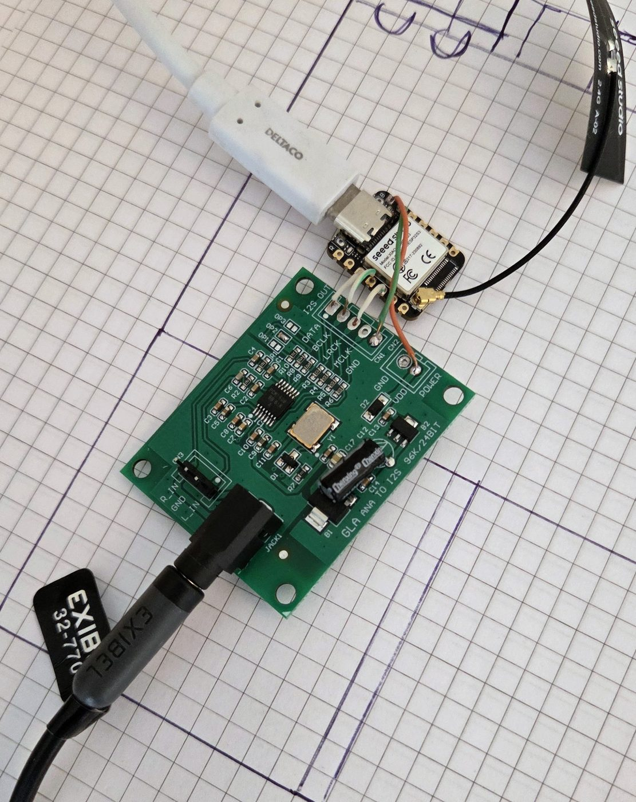
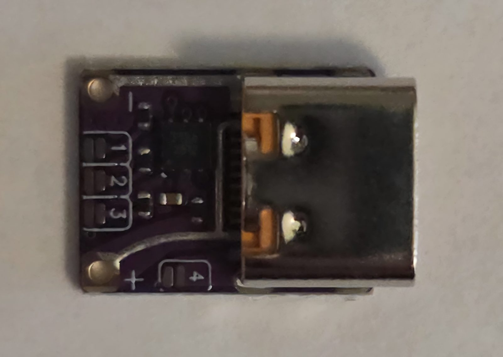
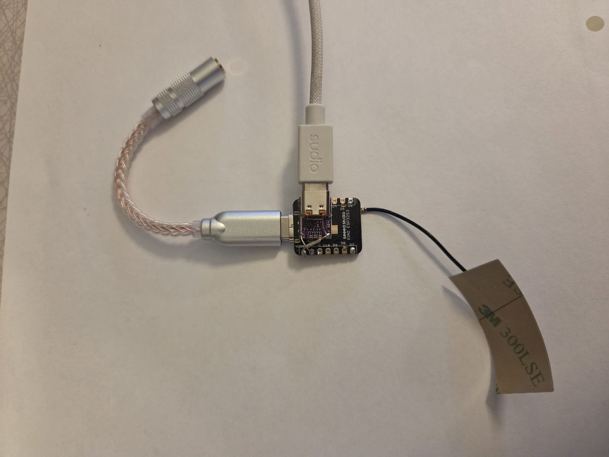

# What an OpenAudioLink node actually looks like

Photographs of the real hardware, so the parts list in
[`../HARDWARE.md`](../HARDWARE.md) has something to be checked against.

There is not much to it. A node is one microcontroller board and one audio
board, and the whole of it fits in a hand. Everything below is a
general-purpose module bought off the shelf — nothing is custom, nothing is
a kit, and there is no OpenAudioLink board to source.

## The microcontroller, shared by every node

| | |
| --- | --- |
|  | **Seeed XIAO ESP32-S3.** 8 MB flash, 8 MB PSRAM, Wi-Fi, USB-C, and a u.FL socket for the external antenna it ships with. About the size of a postage stamp. This is the whole computer: one firmware image runs on all of them and the role is stored in NVS (decision 5), so a Producer and a Consumer are the same board with different settings. |

The antenna is worth fitting. Both hops of a node-to-node stream cross the
air on one channel (run 35), and the radio is the part doing the work.

## A Consumer — a node that plays

Two ways to get sound out, and the firmware supports both from the same
image.

| | |
| --- | --- |
|  | **PCM5102A I²S DAC.** The soldered option: five wires to the XIAO — SCK, BCK, DIN, LCK, plus ground and power — and a 3.5 mm line out. Sounds good, costs a few euros, and needs a soldering iron. |
|  | The two boards side by side, with the XIAO's underside showing the pin labels the wiring diagram in `HARDWARE.md` refers to. |
|  | **A USB-C headphone dongle** — CX31993 with a MAX97220 output stage, the kind sold for phones without a headphone socket. The no-soldering option: the node acts as a USB host and drives it directly (`../USB-AUDIO.md`). |
|  | A finished Consumer using the dongle. XIAO, dongle, antenna, and power in through the second cable. No enclosure yet, and it plays perfectly well like this. |

The two output stages do not play in step with each other — a dongle lags a
soldered DAC by tens of milliseconds — which is what the per-node `delayMs`
setting exists to correct. See [`../TUNING.md`](../TUNING.md).

## A Producer — a node that captures

| | |
| --- | --- |
|  | **PCM1808 I²S ADC** with its own 24.576 MHz oscillator, which matters: the converter's measured rate came out at 47 999 Hz, 21 ppm from nominal, and a source that drifts is a problem no buffer solves. Line in on the 3.5 mm jack, I²S out on the header. |
|  | The turntable Producer, wired and working. XIAO on top, ADC below, antenna, USB power, and the line from the record player going into the jack. |

## Powering a node whose USB port is busy

A Consumer using the USB dongle has a problem the soldered DAC does not:
its only USB-C socket is occupied by the dongle it is driving, and it has
to *supply* that dongle rather than draw from it. Power has to arrive
somewhere else.

| | |
| --- | --- |
|  | **A USB-C PD trigger board.** A modern charger applies no voltage at all until the sink identifies itself on the CC pins, so bare wires to a USB-C charger get nothing — where an old USB-A charger would have handed over 5 V without being asked. This presents the right resistors, the charger turns on, and 5 V comes out on `+` and `−`. The pads marked `1`, `2`, `3` select higher voltages over PD. **Leave all three open.** Nothing on the board says which is which, and one of them puts 20 V onto a 5 V pin. |
|  | The finished USB-audio Consumer. Charger cable into the trigger board, trigger board's `+`/`−` to the XIAO's 5 V and GND, dongle in the XIAO's own port, antenna on its lead. Two USB-C sockets an inch apart that look identical and are not interchangeable: **the charger goes to the small purple board, never to the XIAO.** |

## Photograph notes

Resized and stripped of EXIF before committing. The originals were phone
photographs, which carry GPS coordinates and device identifiers, and this
repository is public — the same reason no Wi-Fi credential has ever been
committed to it.
